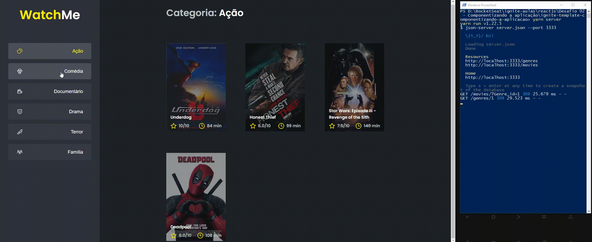

## Preview



## Sobre esse projeto

Este é o segundo desafio da trilha de react proposto pela RocketSeat

***Este é um desafio complementar aos alunos que estão participando do bootcamp***

## Qual é o objetivo

***Refatorar uma página para listagem de filmes de acordo com gênero.*** 

A aplicação foi entregue totalmente funcional mas grande parte do seu código estava diretamente no arquivo App.tsx. 

Para resolver isso da melhor forma, era necessário dividir a aplicação em pelo menos duas partes principais: 

sidebar e o conteúdo principal que possui o header e a listagem de filmes.

## Instalação

Caso tenha ficado interessado em ver o funcionamento, basta seguir esses passos:

(necessário estar com a versão do node 14.18.1 ou inferior!!!!)

```
$ git clone https://github.com/LucasMSCaetano/Desafio02-TrilhaReact-RocketSeat.git

$ cd Desafio02-TrilhaReact-RocketSeat
```

**Instale as dependências**

```
$ yarn
```

_ou_

```
$ npm install
```

**Agora basta executar o comando**

```
$ yarn server

```
_e em um terminal diferente_

```
$ yarn dev
```

Caso tenha ficado alguma duvida ou esteja interessada em bater um papo sobre react me chame em uma das redes sociais abaixo vou adorar trocar essa ideia! ✌😜

<a href = "mailto:lucas.matheu.caetano@gmail.com"></a>
<a href="https://www.linkedin.com/in/lucas-matheus-a95774186/" target="_blank"></a> 
<a href="https://www.instagram.com/lucaxmatheux/" target="_blank"></a>
